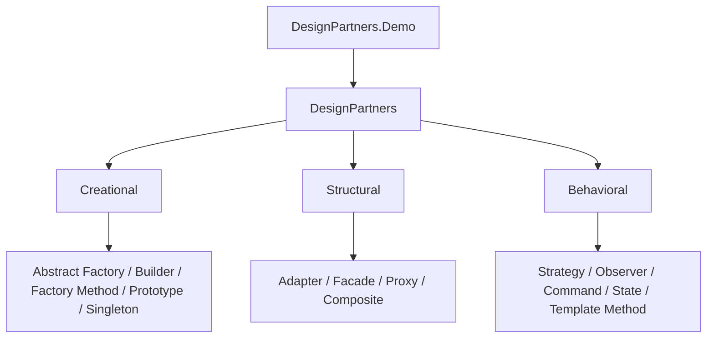

# DesignPartners

### Gang of Four patterns as architecture partners for modern .NET.

[](https://github.com/lcarlini/DesignPartners/actions/workflows/ci.yml)
[](https://dotnet.microsoft.com/)
[](LICENSE)
[](https://lcarlini.github.io/DesignPartners/)

**📖 [Explore the interactive overview →](https://lcarlini.github.io/DesignPartners/)**

A curated C# catalog of **creational**, **structural**, and **behavioral**
design patterns. Each pattern is framed as a design partner you can call when
a specific architectural pressure shows up in a commerce-style domain.

This is a portfolio-grade reference: focused implementations, runnable demos,
automated tests, and CI — not a pile of disconnected snippets.

## Why DesignPartners?

Patterns age poorly when they stay abstract. DesignPartners keeps them
operational by wiring every example into familiar platform concerns: checkout,
shipping, catalog, inventory, and order lifecycle.



Companion deep-dives in this profile:

- [Decorator](https://github.com/lcarlini/Decorator) — composition of cross-cutting policies
- [Mediator](https://github.com/lcarlini/Mediator) — in-process messaging and pipelines
- [SOLID](https://github.com/lcarlini/SOLID) — policy-driven pricing architecture

## Pattern map

| Partner | Family | Design pressure |
| --- | --- | --- |
| Abstract Factory | Creational | Swap regional payment/tax families as one unit |
| Builder | Creational | Assemble complex orders without telescoping constructors |
| Factory Method | Creational | Defer channel creation while sharing notification flow |
| Prototype | Creational | Clone product blueprints into cheap variants |
| Singleton | Creational | Share configuration safely across collaborators |
| Adapter | Structural | Make a legacy freight API speak a modern contract |
| Facade | Structural | Collapse checkout orchestration behind one entry point |
| Proxy | Structural | Cache expensive catalog lookups transparently |
| Composite | Structural | Treat items and nested bundles the same way |
| Strategy | Behavioral | Swap discount algorithms without conditional sprawl |
| Observer | Behavioral | Fan out order events to independent subscribers |
| Command | Behavioral | Capture undoable inventory mutations |
| State | Behavioral | Own valid order lifecycle transitions |
| Template Method | Behavioral | Reuse report structure with customizable steps |

## Quick start

Requirements: [.NET 10 SDK](https://dotnet.microsoft.com/download/dotnet/10.0)

```bash
git clone https://github.com/lcarlini/DesignPartners.git
cd DesignPartners
dotnet restore
dotnet run --project src/DesignPartners.Demo
dotnet test
```

## Repository layout

```text
.
├── src/
│   ├── DesignPartners/          Pattern catalog by family
│   └── DesignPartners.Demo/     End-to-end console walkthrough
├── tests/
│   └── DesignPartners.Tests/    Behavioral coverage per family
├── .github/workflows/           Continuous integration
└── DesignPartners.slnx
```

## Quality checks

```bash
dotnet format --verify-no-changes
dotnet build --configuration Release
dotnet test --configuration Release
```

The build enables nullable reference types, .NET analyzers, deterministic
output, and treats warnings as errors. GitHub Actions runs formatting, build,
tests, and coverage collection on every pull request.

## Extend the catalog

Add a partner under `src/DesignPartners/{Creational|Structural|Behavioral}`,
wire a short path into `DesignPartners.Demo`, and cover the behavior in
`DesignPartners.Tests`. Prefer domain-shaped examples over textbook animal
hierarchies — the goal is transferable architecture judgment.

## License

Licensed under the [MIT License](LICENSE).
